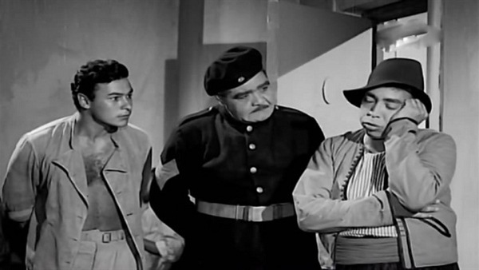
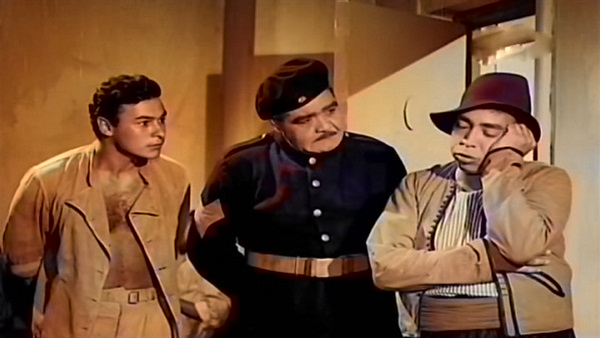
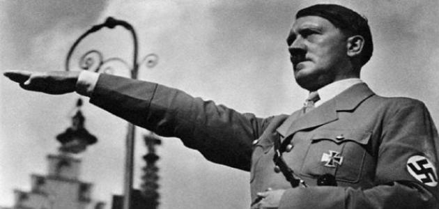
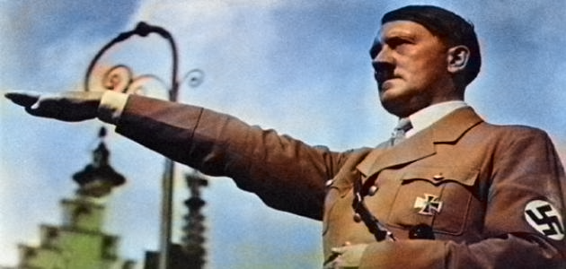

# Coloring-Old-Arabic-Movies

for more details about our project you can see it <a href="https://github.com/teamleader6/Coloring-Old-Arabic-Movies/blob/master/B7b%20El-Cima.pdf">here</a>

- We first tried to train model based on dataset collected by us from old arabic movies but model overfitted on our dataset as the model was too big and so deep and have around 30million parameter and we trained our dataset which was around 55000 image on colab which has limited memory compared to our model.

- Our model based on this <a href="https://arxiv.org/pdf/1603.08511.pdf">paper</a>.

- We used model created by paper's author and downloaded it from <a href="https://github.com/richzhang/colorization">here</a>.

- To test model you just want to download those 2 file <a href="https://drive.google.com/open?id=1oMS0aaYeeNCg9DjT915KXNfVGDnL1PWE">file1</a> and <a href="https://drive.google.com/open?id=1DbeayUWogUjXSoO0nQ13veA3j1CmFUBd">file2</a> and but them in the repo.

- clone this repo after that you shall do the following :  
1- you shall have numpy , opencv and ofcourse python3.  
2- open terminal in the location of the repo after that type python or python3 if you have two versions of python. 
3- then type import Colorize  
4- Colorize.colorize(input_image_path,output_image_path)  
for example Colorize.colorize('test_images/before.jpg','out_images/after.png') which i used to make samples. 

# Samples of inputs and outputs
<table>
    <tr>
        <td></td>
        <td></td>
    </tr>
    <tr>
        <td></td>
        <td></td>
    </tr>
    <tr>
        <td></td>
        <td></td>
    </tr>
    <tr>
        <td></td>
        <td></td>
    </tr>
    <tr>
        <td></td>
        <td></td>
    </tr>
</table>
